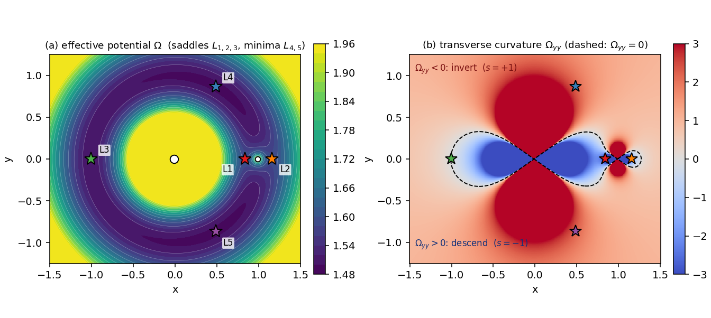
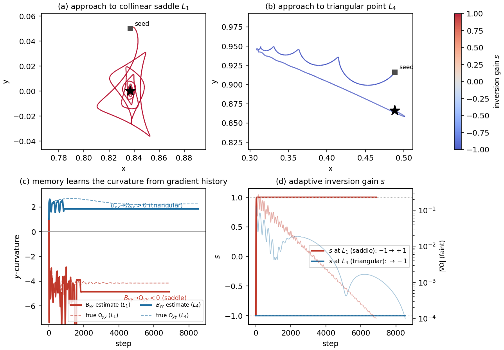
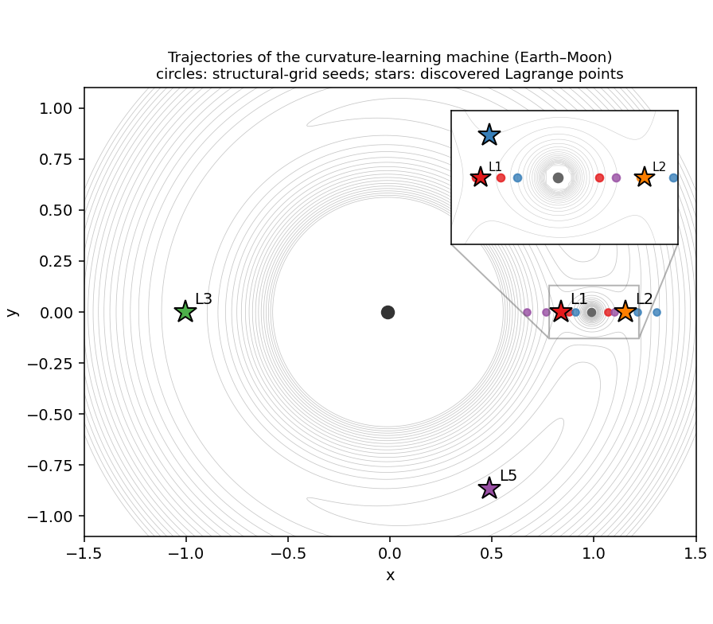

# A curvature-learning MemComputing machine for the Lagrange points

[](https://cibt6y78bubnrhjmev3nbt.streamlit.app)

👉 **Live app**: [cibt6y78bubnrhjmev3nbt.streamlit.app](https://cibt6y78bubnrhjmev3nbt.streamlit.app)

A MemComputing machine that discovers **all five Lagrange points of *every* two-body
system in the solar system** from a generic grid, with no solution coordinates
supplied. A damped flow descends the Jacobi potential and settles onto its
**minima** (the triangular points), but the three **collinear points are saddles**
and a descent is repelled by them. The machine turns each saddle into an attractor
by **inverting the transverse force** — and the inversion sign is supplied by a
**memory that *learns* the local curvature from the gradient history** (a quasi-Newton
estimate of the Hessian, **with no analytic second derivative**). Verified on **all
23** Sun–planet and planet–moon pairs, mass ratios μ ≈ 2×10⁻⁹ (Mars–Deimos) to
μ ≈ 0.11 (Pluto–Charon).

Paper: [`dmm_curvature_ajp.tex`](dmm_curvature_ajp.tex) / [`.pdf`](dmm_curvature_ajp.pdf)
("Locating all Lagrange points with a curvature-learning MemComputing machine,"
D. Henrich & M. Di Ventra). Based on M. Di Ventra, *MemComputing: Fundamentals and
Applications of Time Non-Locality* (Oxford, 2022).

---

## 1. The physics

Work in the co-rotating frame of the two primaries (mass ratio
$\mu = M_2/(M_1+M_2)$), in units where their separation and the orbital angular
velocity are both 1. The primary sits at $(-\mu,0)$, the secondary at $(1-\mu,0)$. We
use the effective potential

$$\Omega(x,y)=\frac{x^2+y^2}{2}+\frac{1-\mu}{r_1}+\frac{\mu}{r_2},\qquad
r_1=\sqrt{(x+\mu)^2+y^2},\quad r_2=\sqrt{(x-1+\mu)^2+y^2}.$$

This is the negative of the Jacobi potential usually written with overall minus
signs; with this convention a **Lagrange point** is a critical point of $\Omega$,

$$\boxed{\nabla\Omega(x,y)=\mathbf{0}}$$

with exactly five solutions. Their **nature** is what the machine must contend with.
The Hessian classifies them:

- the three **collinear** $L_1,L_2,L_3$ (on $y=0$) are **saddles**:
  $\Omega_{xx}>0$ but $\Omega_{yy}<0$ — unstable in the transverse direction;
- the two **triangular** $L_4,L_5$ at $(\tfrac12-\mu,\pm\tfrac{\sqrt3}{2})$ are
  **minima**: $\Omega_{xx}=\tfrac34$, $\Omega_{yy}=\tfrac94$, $\det\mathrm{Hess}=
  \tfrac{27}{4}\mu(1-\mu)>0$.

The single most useful local quantity is the **transverse curvature**

$$\Omega_{yy}=1-\frac{1-\mu}{r_1^3}+\frac{3(1-\mu)y^2}{r_1^5}
              -\frac{\mu}{r_2^3}+\frac{3\mu y^2}{r_2^5}.$$

Its sign tells a saddle from a minimum: $\Omega_{yy}<0$ at the collinear points,
$\Omega_{yy}>0$ ($+2.25$) at $L_4,L_5$.



*Left: the effective potential $\Omega$ (saddles $L_{1,2,3}$, minima $L_{4,5}$).
Right: the transverse curvature $\Omega_{yy}$; where it is negative (red) the machine
inverts the force ($s=+1$), where positive (blue) it descends ($s=-1$). The dashed
line is $\Omega_{yy}=0$. The machine never reads this map — it learns the sign.*

---

## 2. The machine: landscape inversion by a curvature-learning memory

A damped descent on $\Omega$ in the co-rotating frame, with an **inversion gain** $s$
on the transverse force:

$$\boxed{
\begin{aligned}
\ddot x &= 2\dot y - \partial_x\Omega - \gamma\dot x,\\
\ddot y &= -2\dot x + s\partial_y\Omega - \gamma\dot y .
\end{aligned}}$$

With $s=-1$ this is ordinary descent and settles onto the **minima** $L_4,L_5$. At a
collinear **saddle** the transverse direction has $\Omega_{yy}<0$, so descent is
repelled; setting $s=+1$ inverts that one term into a restoring force and the saddle
becomes an attractor. The required rule is $s=-\operatorname{sign}(\Omega_{yy})$.

**No constant inversion works** — and that is the point. Off-axis seeds around the
Earth–Moon $L_1$ (saddle) and $L_4$ (minimum), raw dynamics:

| seed region | $s\equiv-1$ | $s\equiv+1$ | adaptive |
|---|---|---|---|
| $L_1$ collinear saddle | **0/12** | 12/12 | 10/12 |
| $L_4$ triangular minimum | 12/12 | **0/12** | 12/12 |

$s\equiv-1$ never captures the saddle; $s\equiv+1$ breaks the minimum. The sign must
track the local curvature — so a degree of freedom that *adapts* it is genuinely
required (unlike the viscosity $\gamma$, for which any constant value suffices).

**The memory learns the curvature.** Rather than read the analytic $\Omega_{yy}$, a
memory matrix $B$ accumulates a **Broyden (quasi-Newton) estimate of the Hessian**
from the gradient samples the flow already evaluates — with $\Delta\mathbf p$,
$\Delta\mathbf g$ the step's change in position and gradient,

$$B \leftarrow B+\frac{(\Delta\mathbf g-B\Delta\mathbf p)\Delta\mathbf p^{\mathsf T}}
{\Delta\mathbf p^{\mathsf T}\Delta\mathbf p}\quad(\text{symmetrized, slow leak toward }I),
\qquad
\dot s = \alpha\Big[-\tanh\frac{B_{yy}-\theta_s}{\varepsilon_c}-s\Big].$$

The augmented phase space is $(x,y,\dot x,\dot y,s,B)$ — the relaxed mechanical
variables plus the memory $(s,B)$. **No analytic second derivative appears anywhere**
in the dynamics. A safe-state bias $\theta_s<0$ inverts only on a clearly-negative
estimate, protecting the minima and the small-μ corotation ridge.

| Term | Role |
|------|------|
| $\pm2\dot y,\ \mp2\dot x$ | Coriolis (rotating frame; does no work) |
| $-\partial_x\Omega, s\partial_y\Omega$ | descent force; $s$ inverts the transverse component |
| $B$ (Broyden memory) | **learns the Hessian** from the gradient history — no analytic curvature |
| $s=-\tanh((B_{yy}-\theta_s)/\varepsilon_c)$ | **inversion gain** — turns the collinear saddles into attractors |
| $\gamma$ | constant viscosity (removes energy; any value in a broad range works) |



*Two Earth–Moon trajectories of the same machine. The quasi-Newton estimate $B_{yy}$
(solid) tracks the true $\Omega_{yy}$ (dashed) from gradient history alone — negative
at the saddle $L_1$, positive at the minimum $L_4$ — and the gain $s$ responds:
$-1\to+1$ to invert the saddle, held at $-1$ at the minimum.*



*Trajectories of the Hessian-free machine to all five Earth–Moon Lagrange points,
coloured by destination (inset: the cramped $L_1/L_2$ region). No solution
coordinates and no analytic curvature are supplied.*

---

## 3. Finding all five for *any* system

The seed grid (`build_grid`) uses only the **generic structure** of the restricted
three-body problem — never the solution coordinates. $L_1,L_2$ lie on the rotating
axis within a Hill radius $r_H=(\mu/3)^{1/3}$ of the secondary; $L_3$ sits opposite
the primary near $x=-1$; $L_4,L_5$ form equilateral triangles with the primaries:

- on-axis points $(1-\mu)\pm c\cdot r_H$, $c\in\{0.5,0.7,1,1.4,2,3,5,8\}$ → $L_1,L_2$
- points near $x=-1$ → $L_3$
- a block around $(\tfrac12,\pm\tfrac{\sqrt3}{2})$ → $L_4,L_5$
- a coarse off-axis fill for the broad large-μ basins

The flow localizes the basins and a few Newton iterations on $\nabla\Omega=\mathbf0$
snap each endpoint to the exact, μ-dependent zero. This lets the **same machine with
the same parameters** resolve all five down to μ ≈ 10⁻⁹, where the corotation ridge
($\nabla\Omega\approx0$ along $r=1$) makes the collinear points delicate.

---

## 4. Results — all 23 two-body systems

The **same** machine with the **same** parameters, **and no analytic Hessian in its
dynamics**, discovers all five Lagrange points of every Sun–planet and planet–moon
pair. All return **5/5**; refined positions agree with the analytic points to
$<10^{-9}$. $L_4/L_5$ are linearly stable for $\mu<\mu_{\rm Routh}=0.03852$ (all but
Pluto–Charon).

| System | $\mu$ | Found | | System | $\mu$ | Found |
|---|---|---|---|---|---|---|
| Mars–Deimos | $2.3\times10^{-9}$ | 5/5 | | Sun–Uranus | $4.4\times10^{-5}$ | 5/5 |
| Sun–Pluto | $6.6\times10^{-9}$ | 5/5 | | Jupiter–Io | $4.7\times10^{-5}$ | 5/5 |
| Mars–Phobos | $1.7\times10^{-8}$ | 5/5 | | Sun–Neptune | $5.1\times10^{-5}$ | 5/5 |
| Sun–Mercury | $1.7\times10^{-7}$ | 5/5 | | Jupiter–Callisto | $5.7\times10^{-5}$ | 5/5 |
| Saturn–Enceladus | $1.9\times10^{-7}$ | 5/5 | | Jupiter–Ganymede | $7.8\times10^{-5}$ | 5/5 |
| Sun–Mars | $3.2\times10^{-7}$ | 5/5 | | Neptune–Triton | $2.1\times10^{-4}$ | 5/5 |
| Sun–Venus | $2.4\times10^{-6}$ | 5/5 | | Saturn–Titan | $2.4\times10^{-4}$ | 5/5 |
| Sun–Earth | $3.0\times10^{-6}$ | 5/5 | | Sun–Saturn | $2.9\times10^{-4}$ | 5/5 |
| Saturn–Rhea | $4.1\times10^{-6}$ | 5/5 | | Sun–Jupiter | $9.5\times10^{-4}$ | 5/5 |
| Jupiter–Europa | $2.5\times10^{-5}$ | 5/5 | | Earth–Moon | $1.2\times10^{-2}$ | 5/5 |
| Uranus–Oberon | $3.5\times10^{-5}$ | 5/5 | | Pluto–Charon | $1.1\times10^{-1}$ | 5/5 |
| Uranus–Titania | $4.1\times10^{-5}$ | 5/5 | | | | |

Reproduce the Hessian-free run with `python rung2_final.py`, or run the app on any
system.

---

## 5. Scope and honest notes

- **The memory is load-bearing — the *inversion*, not the damping.** No constant
  inversion sign finds both the saddles and the minima (§2), so the memory that
  carries it is genuinely necessary. By contrast the viscosity is *not* special: a
  constant $\gamma$ in $[0.1,1]$ finds all 23 systems just as well (`check_static_*.py`),
  so a memory-controlled *damping* would buy nothing. What the memory does that
  nothing static can is **learn the curvature** from the gradient history.
- **No analytic second derivative.** The Broyden memory estimates the Hessian from
  the gradients the flow already computes (a genuine quasi-Newton computation). An
  earlier, reactive instability detector was outrun by the saddle's exponential
  runaway; the predictive quasi-Newton accumulation is what works
  (`rung2_broyden.py`, `rung2_fix.py`).
- **Corotation-ridge degeneracy at small μ — handled** by the structural seed grid
  of §3 (on-axis Hill-radius seeds, an equilateral block), not by tuning the solver.
- **Not a competitor to root-finding.** Newton/Brent locate a single point in
  $\mathcal O(10)$ evaluations *given a bracket*; this machine finds all five from a
  generic grid with no such input, at $10^4$–$10^5$ evaluations per trajectory, and we
  keep an optional Newton polish for the final digits. Its purpose is to isolate the
  computational role of memory, not to outrun a bracketed solver.

---

## 6. Run

```bash
pip install -r requirements.txt
streamlit run solar_system_dmm_v3.py
```

Pick a two-body system in the sidebar and choose the **Machine**:

- **Curvature-learning (quasi-Newton memory)** — the default; the new machine above.
  The *Memory dynamics* tab shows $B_{yy}$ learning the true $\Omega_{yy}$ and the
  inversion gain $s$ flipping $-1\to+1$ at the saddles.
- **Memory-as-dissipation (v3)** — the earlier machine (memory controls the damping,
  $\gamma_{\rm eff}=\gamma_0+\kappa m$, with $\sigma=\mathrm{sign}(-\Omega_{yy})$ read
  from the analytic curvature). It also gives 5/5, but here the dissipation a constant
  could supply is not load-bearing; kept for comparison.

### Bonus apps

```bash
streamlit run solar_system_dmm_v4.py   # every Sun–planet pair's L-points at once
streamlit run solar_system_dmm_v5.py   # which L-points actually hold particles (tadpole librations)
```

`v4` superposes the per-pair Lagrange points heliocentrically (the full Sun + 8-planet
system has **no** global Lagrange points — no single co-rotating frame freezes them
all). `v5` forward-integrates test-particle clouds in the time-dependent Sun + planets
field: $L_4/L_5$ trace **tadpole** librations and stay (period $\approx T/\sqrt{27\mu/4}$,
~148 yr for Jupiter); the collinear saddles drift away — the dynamical face of the
curvature sign $\Omega_{yy}$.

| File | Description |
|------|-------------|
| `solar_system_dmm_v3.py` | The app: curvature-learning machine (default) + memory-as-dissipation, across 23 systems |
| `streamlit_app.py` | Default deploy entry point → launches the v3 app |
| `nbody_trojan.py` | **Single source of truth** for CR3BP geometry + heliocentric dynamics (see §7) |
| `test_nbody_trojan.py` | Numerical regression tests — the physics claims, as `assert`s |
| `dmm_curvature_ajp.tex` / `.pdf` | **Paper** (AJP) — the curvature-learning machine, equations, parameters, all-23 table |
| `rung2_final.py` | All-23 verification of the Hessian-free machine (5/5 everywhere) |
| `rung2_broyden.py`, `rung2_fix.py` | The Broyden mechanism (off-axis) and the safe-state bias |
| `sigma_role_test.py` | The "no constant inversion works" controls |
| `check_static_gamma.py`, `check_static_nopolish.py` | A constant $\gamma$ also finds all 23 (damping is not special) |
| `make_paper_figs.py`, `make_memory_plot.py` | Reproduce the figures (PDF + PNG) |
| `requirements.txt` | numpy, scipy, matplotlib, streamlit, plotly |

---

## 7. Code architecture — one source of truth, with tests

The CR3BP geometry — the effective potential $\Omega$, its gradient, the curvature
$\Omega_{yy}$, and the five Lagrange points — lives once in **`nbody_trojan.py`**:

```python
effective_potential(x, y, mu)   # Ω(x,y)
grad_curv(x, y, mu)             # (∂ₓΩ, ∂ᵧΩ, Ωᵧᵧ)
analytical_collinear(mu)        # x-positions of L1, L2, L3
lpoints(mu)                     # dict {L1..L5: np.array([x,y])}
```

Every consumer imports them, so a fix to the softening or a root-finding bracket
applies everywhere at once.

### Tests (`test_nbody_trojan.py`)

The numbers the manuscript relies on are pinned as assertions:

```bash
python test_nbody_trojan.py        # or: python -m pytest test_nbody_trojan.py -v
```

| Test | What it pins |
|------|--------------|
| `test_l4_l5_are_equilateral` | L4/L5 form unit equilateral triangles with the primaries |
| `test_collinear_points_on_xaxis` | L1/L2/L3 lie on y=0, ordered correctly |
| `test_gradient_zero_at_lagrange_points` | $\nabla\Omega=\mathbf 0$ at all five equilibria |
| `test_gradient_formula_matches_reference` | the exact textbook gradient expression |
| `test_effective_potential_formula` | the exact $\Omega$ expression |
| `test_jacobi_constant_jupiter_l4` | Jacobi constant conserved to rel $<10^{-6}$ over 200 yr |
| `test_l4_bounded_libration_jupiter` | a body at Jupiter L4 stays bounded over 1000 yr |
| `test_trojan_libration_period` | $T_{\rm lib}=P/\sqrt{27\mu/4}\approx 148$ yr for Jupiter |
| `test_seed_lpoint_corotation_velocity` | seed velocity is exact co-rotation $v=n\hat z\times r$ |

These double as living documentation of the physics claims in §4–§5.

---

## References

1. M. Di Ventra, *MemComputing: Fundamentals and Applications of Time Non-Locality*, Oxford University Press (2022)
2. F. L. Traversa & M. Di Ventra, "Universal Memcomputing Machines," *IEEE Trans. Neural Netw. Learn. Syst.* **26**, 2702 (2015)
3. C. G. Broyden, "A class of methods for solving nonlinear simultaneous equations," *Math. Comp.* **19**, 577 (1965)
4. V. Szebehely, *Theory of Orbits: The Restricted Problem of Three Bodies*, Academic Press (1967)
5. D. Henrich, "DigitalMemComputing," GitHub (2026): https://github.com/drhenrich/DigitalMemComputing
