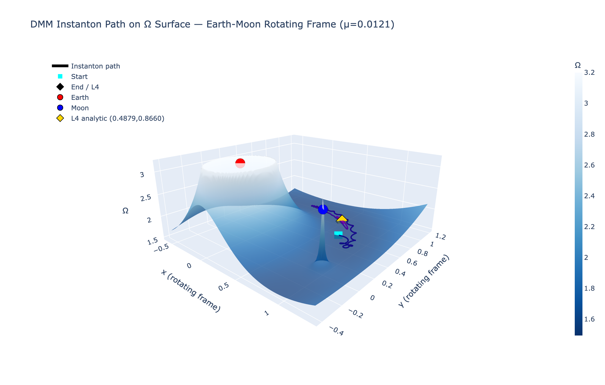
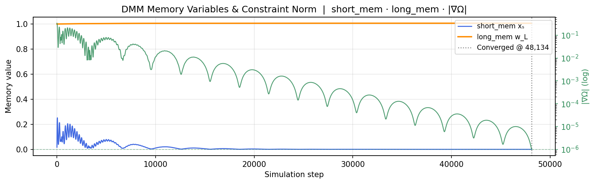

# Digital MemComputing — Restricted 3-Body L4 Lagrange Point

A Python emulator of a **Digital MemComputing Machine (DMM)** that finds the **L4 Lagrange point** in the Earth-Moon rotating frame.

Based on: *Massimiliano Di Ventra — MemComputing: Fundamentals and Applications of Time Non-Locality* (Oxford University Press, 2022).

---

## Live Demo

[](https://digitalmemcomputing-jl3twekdcwjdkgx3xbbcu3.streamlit.app)

👉 **[Launch interactive app](https://digitalmemcomputing-jl3twekdcwjdkgx3xbbcu3.streamlit.app)**

---

## Screenshots

### Interactive 3D surface — drag to rotate, scroll to zoom


### DMM memory dynamics


---

## Physics

The simulation solves the **restricted 3-body problem** (Earth + Moon as primaries, infinitesimal test mass) in the co-rotating frame. The DMM emulator uses memory variables as dynamic Lagrange multipliers to drive the system toward the equilibrium condition ∇Ω = 0.

**Equations of motion (rotating frame):**

```
ẍ =  2ẏ − w_L · ∂Ω/∂x − γẋ
ÿ = −2ẋ − w_L · ∂Ω/∂y − γẏ
```

where `Ω = (x²+y²)/2 + (1−μ)/r₁ + μ/r₂` is the effective potential and `w_L` is the DMM long-term memory variable.

**DMM memory update:**
```
x_s ← (1−α)·x_s + α·|∇Ω|     # short-term: tracks constraint violation
w_L ← min(w_L + β·x_s·Δt, cap) # long-term: amplifies force until clause satisfied
```

**L4 analytic position:** `(0.5 − μ, √3/2) ≈ (0.4879, 0.8660)` — equilateral triangle with both primaries.

**Routh's criterion:** L4/L5 are stable attractors only for `μ < 0.0385`. The Coriolis terms (`±2ẋ/ẏ`) are essential — without them, gradient descent falls into Earth's gravity well.

---

## Files

| File | Description |
|------|-------------|
| `3body.py` | Standalone simulation — runs and plots with matplotlib |
| `3body_app.py` | Interactive Streamlit app with 3D Plotly surface |
| `requirements.txt` | Python dependencies |

---

## Run

**Standalone:**
```bash
python 3body.py
```

**Interactive Streamlit app:**
```bash
pip install -r requirements.txt
streamlit run 3body_app.py
```

Then open [http://localhost:8501](http://localhost:8501). The 3D surface is fully interactive — drag to rotate, scroll to zoom.

### Sidebar controls

| Parameter | Description |
|-----------|-------------|
| μ | Moon/total mass ratio (max 0.038 = Routh's limit) |
| Δx, Δy | Starting position offset from L4 |
| α, β | Short/long-term memory decay and growth rates |
| long_mem cap | Upper bound on the memory multiplier |
| γ (damping) | Must be ≪ 2·ω_libration ≈ 1.7 to stay underdamped |
| Δt, max steps | Integration parameters |

---

## Key insight

The original document code had three compounding bugs:

1. **Wrong force sign** — used `+∇Ω` (gradient ascent) instead of `−∇Ω`
2. **Missing Coriolis** — replaced with generic damping; Coriolis is what makes L4 a stable attractor
3. **No singularity guard** — no `eps` floor on r₁, r₂ → overflow when particle approached a body
