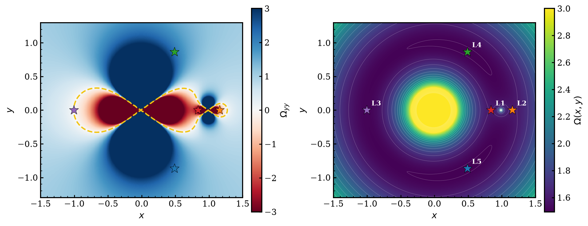
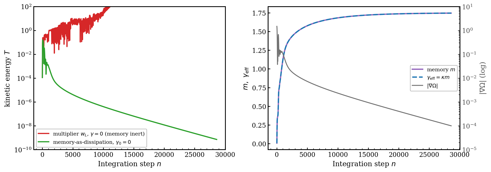
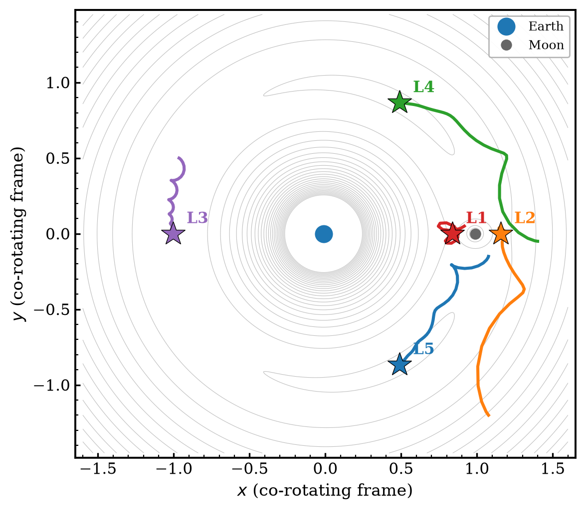
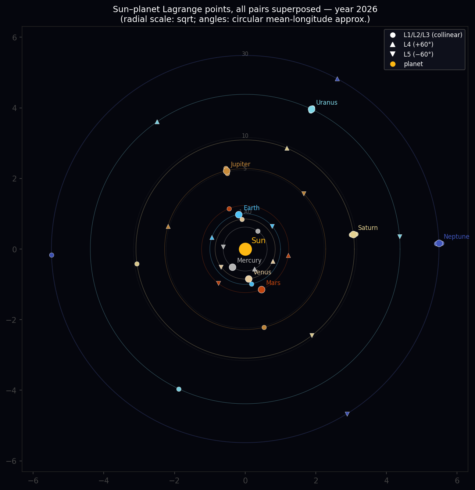
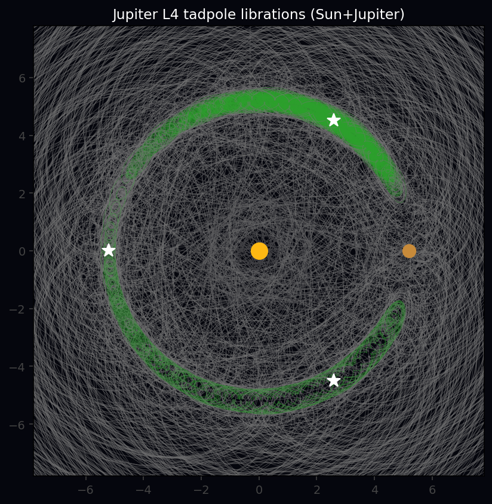

# Memory as Dissipation — Lagrange Points of the Restricted Three-Body Problem

[](https://cibt6y78bubnrhjmev3nbt.streamlit.app)

👉 **Live app** (v4 solar-system map): [cibt6y78bubnrhjmev3nbt.streamlit.app](https://cibt6y78bubnrhjmev3nbt.streamlit.app) — run `solar_system_dmm_v3.py` locally for the discovery method described below.

A continuous dynamical system that locates **all five Lagrange points** of the
planar restricted three-body problem from generic starting conditions — with no
solution coordinates supplied. The project is a controlled test bed for a
precise physics question: **which term in the equations of motion actually does
the computation?** The answer turns out to be subtle, and fixing it is the whole
point of this code.

Full derivation: [`dmm_lagrange_v3.tex`](dmm_lagrange_v3.tex) / [`.pdf`](dmm_lagrange_v3.pdf).
Based on the MemComputing framework of M. Di Ventra, *Fundamentals and
Applications of Time Non-Locality* (Oxford, 2022).

---

## 1. The physics

Work in the co-rotating frame of the two primaries (mass ratio
$\mu = M_2/(M_1+M_2)$), in units where their separation and the orbital angular
velocity are both 1. The primary sits at $(-\mu,0)$, the secondary at
$(1-\mu,0)$. A test particle feels the **Jacobi effective potential**

$$\Omega(x,y)=\frac{x^2+y^2}{2}+\frac{1-\mu}{r_1}+\frac{\mu}{r_2},\qquad
r_1=\sqrt{(x+\mu)^2+y^2},\;\; r_2=\sqrt{(x-1+\mu)^2+y^2}.$$

The first term is the centrifugal potential of the rotating frame; the other two
are the gravity wells of the primaries. A **Lagrange point** is a relative
equilibrium — the particle is stationary in the rotating frame — so every
velocity and acceleration vanishes and the condition collapses to a single
vector clause:

$$\boxed{\;\nabla\Omega(x,y)=\mathbf{0}\;}$$

This has exactly five solutions: three **collinear saddle points** $L_1,L_2,L_3$
on the axis $y=0$, and two **triangular maxima** $L_4,L_5$ at
$(\tfrac12-\mu,\pm\tfrac{\sqrt3}{2})$.

The single most useful local quantity is the **transverse curvature**

$$\Omega_{yy}=1-\frac{1-\mu}{r_1^3}+\frac{3(1-\mu)y^2}{r_1^5}
              -\frac{\mu}{r_2^3}+\frac{3\mu y^2}{r_2^5}.$$

Its sign tells a saddle from a maximum using only information available at the
current point: $\Omega_{yy}<0$ at the collinear points (e.g. Earth–Moon:
$-4.15,-2.19,-0.011$ at $L_1,L_2,L_3$), $\Omega_{yy}>0$ ($+2.25$) at $L_4,L_5$.



*Left: the curvature $\Omega_{yy}$. Red ($\Omega_{yy}<0$) is where the
correction current activates. Right: the effective potential $\Omega$. Stars
mark the five Lagrange points.*

---

## 2. The key idea — and why the obvious memory does nothing

The natural MemComputing transcription drives a particle downhill on $\Omega$
with a **memory variable that multiplies the force** and grows while the clause
is violated:

$$\ddot x = 2\dot y - w_L\,\partial_x\Omega - \gamma\dot x,\qquad
\ddot y = -2\dot x - w_L\,\partial_y\Omega - \gamma\dot y,\qquad
\dot w_L = \beta\lVert\nabla\Omega\rVert .$$

**This memory is dynamically inert.** Take the kinetic energy
$T=\tfrac12\lVert\dot{\mathbf r}\rVert^2$ and differentiate along the motion:

$$\dot T = \underbrace{2(\dot x\dot y-\dot y\dot x)}_{=\,0\ \text{(Coriolis)}}
          \;-\;w_L\,\dot{\mathbf r}\cdot\nabla\Omega\;-\;\gamma\lVert\dot{\mathbf r}\rVert^2 .$$

The Coriolis force does **no work**. The memory enters only through
$-w_L\,\dot{\mathbf r}\cdot\nabla\Omega$ — the power of a **conservative** force
scaled by $w_L$ — which merely shuttles energy between kinetic and potential
form and has no definite sign. The **only** term that can remove kinetic energy
is the viscous one, $-\gamma\lVert\dot{\mathbf r}\rVert^2$. A growing multiplier
on a conservative force can only *stiffen the well*, not damp the motion (at
$\gamma=0$ one finds $\dot E = +\tfrac12\dot w_L\,k\,y^2 \ge 0$ — it adds
energy).

This is not a subtlety — it is decisive, and it is confirmed numerically:

- setting the growth rate **β = 0 changes nothing** (results identical to the
  nominal β); the multiplier never departs from $w_L\approx1$ by more than 0.2%;
- with the damping **γ = 0 the system fails for every β**.

**The damping was doing the computation, not the memory.**

---

## 3. The fix — memory *is* the dissipation

The energy identity says exactly where memory has to go: into the **only channel
that can remove kinetic energy**, the velocity coupling. So let an accumulated
memory $m$ set the **damping coefficient** instead of the force:

$$\boxed{\;
\begin{aligned}
\ddot x &= 2\dot y \;-\; \partial_x\Omega \;-\; \gamma_{\rm eff}\,\dot x,\\
\ddot y &= -2\dot x \;+\; \sigma\,\partial_y\Omega \;-\; \gamma_{\rm eff}\,\dot y,\\
\dot m &= \beta\,\lVert\nabla\Omega\rVert,\qquad m\le m_{\rm cap},\\
\gamma_{\rm eff} &= \gamma_0 + \kappa\,m .
\end{aligned}\;}$$

**Term by term:**

| Term | Role | Rationale |
|------|------|-----------|
| $\pm2\dot y,\ \mp2\dot x$ | Coriolis | inherited from the rotating frame; does no work |
| $-\partial_x\Omega,\ \sigma\,\partial_y\Omega$ | force | gradient of $\Omega$, with unit gain (the inert multiplier is gone) |
| $\sigma=\mathrm{sign}(-\Omega_{yy})$ | **correction current** | flips the transverse force where $\Omega_{yy}<0$, turning the collinear **saddles into attractors** of the damped flow |
| $\dot m=\beta\lVert\nabla\Omega\rVert$ | **memory** | monotone ratchet; $m(t)=\beta\!\int_0^t\!\lVert\nabla\Omega\rVert\,d\tau$ is the accumulated violation — a Lyapunov-type functional |
| $\gamma_{\rm eff}=\gamma_0+\kappa m$ | **dissipation** | memory now multiplies $\lVert\dot{\mathbf r}\rVert^2$, the negative-definite term — so it **can** dissipate |

With **$\gamma_0=0$** the memory $m$ is the *sole* source of dissipation: at
$t=0$ the flow is undamped, and braking appears only as $m$ accumulates from the
violation history. This is the clean test of whether memory computes — and it
passes:



*Left: kinetic energy $T$ for one initial condition with no external damping.
The inert multiplier (red) stays $\mathcal O(1)$ and grows; memory-as-dissipation
(green) drives $T\to0$. Right: the memory $m$ and the damping
$\gamma_{\rm eff}=\kappa m$ it generates ratchet up from zero and saturate, while
$\lVert\nabla\Omega\rVert$ (grey) decays to threshold.*

Where the multiplier formulation finds 0–1 of 5 points without external damping,
memory-as-dissipation finds **all five** (94/100 trajectories converging on
Earth–Moon). The memory is now **necessary for convergence** — it is doing the
work.

> Why **scalar** memory and not per-axis? Using the full gradient norm
> $\lVert\nabla\Omega\rVert$ damps both axes equally. A per-axis rule
> $\dot m_i=\beta|\partial_i\Omega|$ underdamps the transverse direction on the
> collinear axis (where $|\partial_y\Omega|\approx0$), and the trajectory
> oscillates past $L_2,L_3$.



*Representative instanton paths to all five Lagrange points (Earth–Moon), one
per equilibrium, from a 10×10 grid of starts. No solution coordinates are given
to the integrator.*

---

## 4. Results

Same equations, same parameters ($\gamma_0=0,\ \kappa=1,\ \beta=0.5$),
100 starts per system:

| System | $\mu$ | Found | Note |
|--------|-------|-------|------|
| Pluto–Charon | $1.1\times10^{-1}$ | **5/5** | $\mu>$ Routh limit: $L_4,L_5$ found but linearly unstable |
| Earth–Moon | $1.2\times10^{-2}$ | **5/5** | clean, 0 spurious |
| Sun–Jupiter | $9.5\times10^{-4}$ | **5/5** | |
| Sun–Earth | $3.0\times10^{-6}$ | **5/5** | many trajectories rejected on the ridge |
| Sun–Mercury | $1.7\times10^{-7}$ | **4/5** | $L_2$ lost — corotation-ridge limit (below) |

A few Newton iterations on $\nabla\Omega=\mathbf0$ optionally polish each
converged endpoint to machine precision (the five $L$-points are the *only* exact
zeros), with fall-back to the raw endpoint where Newton is ill-conditioned.

---

## 5. Limitations (stated honestly)

- **Corotation-ridge degeneracy at small μ.** As $\mu\to0$,
  $\Omega\to\tfrac12 r^2+1/r$, whose gradient vanishes along the **entire** unit
  circle $r=1$, not at isolated points. For tiny $\mu$ the secondary lifts this
  by only $\mathcal O(\mu)$, so $\lVert\nabla\Omega\rVert\lesssim\mathcal O(\mu)$
  all along $r=1$. Any fixed threshold $10^{-4}$ is then met *everywhere* on the
  ridge once $\mu\lesssim10^{-4}$, and trajectories halt on spurious ridge points
  instead of localizing. This is why Sun–Mercury returns 4/5. It is a property of
  the RTBP potential at extreme mass ratios, **not** a solver bug; the Hessian is
  near-singular there, so Newton refinement is ill-conditioned too.
- **Memory is a single scalar.** $m$ provides a genuine, monotone, dissipative
  (Lyapunov-type) role, but it is one scalar controlling a viscous coefficient —
  not yet the full vector, constraint-coupled memory structure of a *universal*
  Digital MemComputing Machine. A complete Lyapunov analysis and a vector-memory
  extension are the natural next steps.
- **Speed.** With $\gamma_0=0$ the damping ramps up from zero, so convergence is
  slower than a tuned constant-damping descent (median ~3×10⁴ steps on
  Earth–Moon). A small $\gamma_0>0$ floor trades the "memory is the *sole*
  dissipation" purity for speed.
- **Not a competitor to root-finding.** Newton/Brent locate a single point in
  $\mathcal O(10)$ evaluations *given a bracket or guess*. This system finds all
  five from a generic grid with no such input, at $10^4$–$10^5$ evaluations per
  trajectory. Its purpose is to isolate the computational role of memory, not to
  outrun a solver whose answers are already bracketed.

---

## 6. Run

```bash
pip install -r requirements.txt
streamlit run solar_system_dmm_v3.py   # the method described above (memory-as-dissipation)
streamlit run streamlit_app.py         # default deploy entry → the v4 solar-system map
```

Pick a two-body system in the sidebar, set the controls ($\gamma_0,\kappa,\beta$,
grid), and press **Run**. The *Memory dynamics* tab shows $m$, $\gamma_{\rm eff}$,
the kinetic energy $T\to0$, and $\lVert\nabla\Omega\rVert$ — i.e. memory doing
the work.

### Bonus: all Sun–planet Lagrange points at once (`solar_system_dmm_v4.py`)

```bash
streamlit run solar_system_dmm_v4.py
```



A heliocentric snapshot of every Sun–planet pair's five Lagrange points,
superposed at a chosen epoch (● collinear, ▲ L4 +60°, ▼ L5 −60°). **Important:**
the full Sun + 8-planet system has **no global Lagrange points** — the planets
orbit at different rates, so no co-rotating frame freezes them all and no
time-independent $\Omega$ exists. This view superposes the *per-pair* points
(each discovered by the v3 DMM and mapped to AU), which is where real objects
sit — JWST at Sun–Earth $L_2$, the Jupiter Trojans at $L_4/L_5$.

### Bonus: which Lagrange points are dynamically *stable*? (`solar_system_dmm_v5.py`)

```bash
streamlit run solar_system_dmm_v5.py
```



v3 *locates* the equilibria; v5 asks which ones actually **hold particles**. It
forward-integrates clouds of test particles in the time-dependent field of the
**Sun + planets** (heliocentric velocity-Verlet *with the indirect term*) and
shows which survive. $L_4/L_5$ (stable for $\mu<0.03852$) trace **tadpole**
librations and stay — period $\approx T/\sqrt{27\mu/4}$, ~148 yr for Jupiter,
matching theory to 0.1% in the validation. The collinear $L_1/L_2/L_3$ (saddles)
drift away. A toggle switches between "Sun + host planet" (restricted 3-body) and
"Sun + all 8 planets" (the full time-dependent field) to see the perturbations.
This is the dynamical face of the curvature sign $\Omega_{yy}$ that v3 reads.

| File | Description |
|------|-------------|
| `streamlit_app.py` | Default deploy entry point → launches the v4 solar-system map |
| `solar_system_dmm_v3.py` | The app: memory-as-dissipation across 23 two-body systems |
| `dmm_lagrange_v3.tex` / `.pdf` | Paper — full equations, rationale, proofs, limitations |
| `dmm_lagrange_stability.tex` / `.pdf` | Extended edition — adds an N-body Trojan stability cross-check section |
| `generate_v3_figures.py` | Reproduces the figures above (PDF + PNG) |
| `diagnose_concerns.py`, `explore_sigma_memory.py`, `test_v3_core.py` | Validation scripts — every number here is reproducible |
| `requirements.txt` | numpy, scipy, matplotlib, streamlit, plotly |

---

## References

1. M. Di Ventra, *MemComputing: Fundamentals and Applications of Time Non-Locality*, Oxford University Press (2022)
2. F. L. Traversa & M. Di Ventra, "Universal Memcomputing Machines," *IEEE Trans. Neural Netw. Learn. Syst.* **26**, 2702 (2015)
3. V. Szebehely, *Theory of Orbits: The Restricted Problem of Three Bodies*, Academic Press (1967)
4. D. Henrich, "DigitalMemComputing," GitHub (2026): https://github.com/drhenrich/DigitalMemComputing
