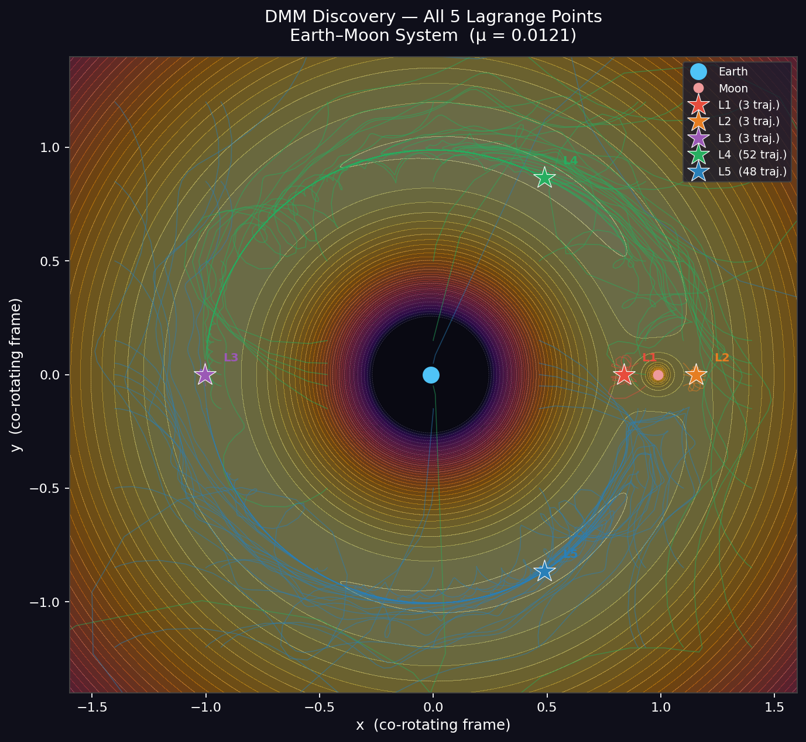
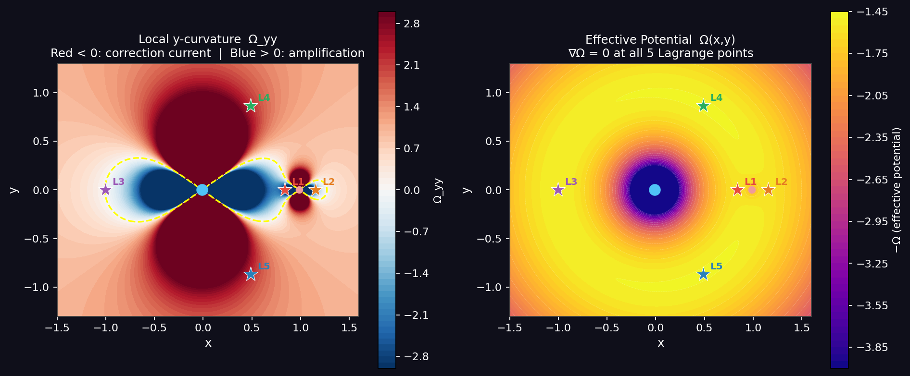
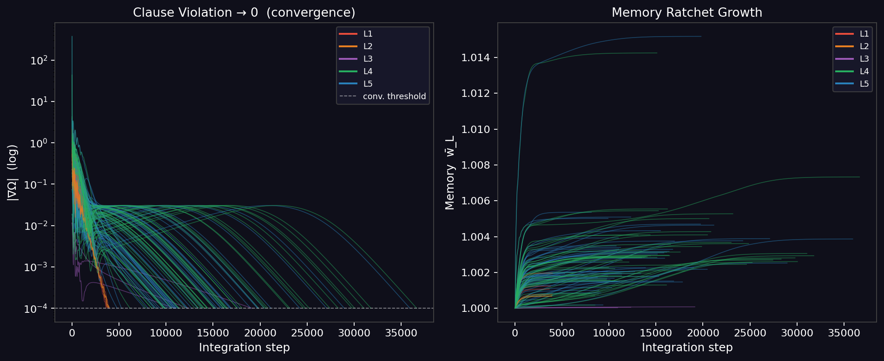

# Digital MemComputing — Lagrange Point Discovery

A Python implementation of a **Digital MemComputing Machine (DMM)** that discovers all five Lagrange points of the Earth–Moon restricted three-body problem — **without prior knowledge** of how many solutions exist or where they are.

Based on: *Massimiliano Di Ventra — MemComputing: Fundamentals and Applications of Time Non-Locality* (Oxford University Press, 2022).

---

## Key idea

Classical solvers (Newton, Brent) require one good initial guess per solution and prior knowledge of the solution structure. The DMM instead maps the constraint-satisfaction problem — find all (x, y) where ∇Ω = 0 — onto a continuous dynamical system. Memory variables grow monotonically as dynamic Lagrange multipliers, amplifying the effective force until every clause (force-balance condition) is satisfied.

The critical novelty: the machine reads the **local y-curvature Ω_yy** at each integration step and adapts its force sign automatically. At saddle points (L1/L2/L3, where Ω_yy < 0), a **correction current** flips the otherwise-repulsive y-force into a restoring one, transforming classically unstable equilibria into stable fixed points of the extended phase space. At stable attractors (L4/L5, where Ω_yy > 0), standard memory amplification applies. No solution coordinates are provided.

---

## Discovery map



Each coloured line is one DMM trajectory evolving from a grid start. Every trajectory terminates at a Lagrange point (★). L4/L5 attract most of the plane; L1/L2/L3 have narrow basins but are reliably found by the correction-current mechanism.

---

## Effective potential and local curvature



**Left:** the local y-curvature Ω_yy across the co-rotating plane. Red regions (Ω_yy < 0) are y-saddle directions where standard gradient descent would diverge — the DMM applies a correction current there. Blue regions (Ω_yy > 0) use standard memory amplification. The dashed yellow contour marks Ω_yy = 0.

**Right:** the effective potential Ω(x, y). All five Lagrange points are critical points (∇Ω = 0) at different topological types — two stable attractors (L4/L5, Coriolis-stabilised), three saddles (L1/L2/L3).

---

## Memory dynamics



**Left:** clause violation |∇Ω| falls to zero along every trajectory — the machine halts when constraints are satisfied. **Right:** the long-term memory ratchet w̄_L grows monotonically, amplifying the effective force (or correction current) until convergence. L4/L5 (green/blue) converge quickly; L3 (purple) is slowest due to its near-flat curvature (Ω_yy ≈ −0.011).

---

## Equations of motion

In the co-rotating frame with Coriolis terms:

```
ẍ = 2ẏ − w_L^x · ∂Ω/∂x − γẋ
ÿ = −2ẋ + σ · w_L^y · ∂Ω/∂y − γẏ
```

where `σ = +1` if `Ω_yy < 0` (correction current) and `σ = −1` otherwise.

**Per-axis memory update (ratchet):**
```
sm_x ← (1−α) · sm_x + α · |∂Ω/∂x|       # short-term: EMA of clause violation
w_L^x ← min(w_L^x + β · sm_x · Δt, cap)  # long-term: monotone ratchet
```
(same for y-axis independently)

**Effective potential:**
```
Ω = (x² + y²)/2 + (1−μ)/r₁ + μ/r₂
```

**Local y-curvature (computed analytically at each step):**
```
Ω_yy = 1 − (1−μ)/r₁³ + 3(1−μ)y²/r₁⁵ − μ/r₂³ + 3μy²/r₂⁵
```

---

## Speed vs classical methods

| Method | Time / point | Func. evals | Error | Prior knowledge required |
|--------|-------------|-------------|-------|--------------------------|
| Brent | 0.007–0.018 ms | 11–13 | machine ε | bracket per root + know y = 0 |
| Newton / fsolve | 0.03–0.20 ms | 9–34 | ~10⁻¹⁴ | 1 guess per point |
| Nelder-Mead (min\|∇Ω\|²) | 1.2–2.7 ms | 117–236 | ~10⁻¹¹ | 1 guess per point |
| **DMM** | 66–378 ms | 6,000–35,000 | 10⁻⁵–10⁻⁷ | none |

DMM is slower per individual point but discovers **all solutions simultaneously** from a single grid of starts, with no knowledge of solution count or location. Classical methods are faster only when the solution structure is already known — which in a real discovery problem it is not.

---

## Analytic results (μ = 0.0121, Earth–Moon)

| Point | x | y | Ω_yy | Type |
|-------|---|---|------|------|
| L1 | 0.83716 | 0.00000 | −4.146 | saddle (Moon-inner) |
| L2 | 1.15549 | 0.00000 | −2.191 | saddle (Moon-outer) |
| L3 | −1.00504 | 0.00000 | −0.011 | saddle (Earth-far) |
| L4 | 0.48790 | +0.86603 | +2.250 | equilateral triangle — stable |
| L5 | 0.48790 | −0.86603 | +2.250 | equilateral triangle — stable |

L4/L5 stability requires μ < 0.03852 (Routh's criterion). Earth–Moon μ = 0.0121 satisfies this.

---

## Files

| File | Description |
|------|-------------|
| `dmm_discovery.py` | **Main app** — discovers all 5 L-points from a grid, no prior knowledge |
| `3body_app.py` | Earlier app — single L-point targeting with interactive 3D surface |
| `dmm_lagrange.tex` | Scientific article (LaTeX, two-column) |
| `requirements.txt` | Python dependencies |
| `discovery_map.png` | Trajectory discovery map |
| `discovery_memory.png` | Memory dynamics panel |
| `potential_curvature.png` | Effective potential and curvature map |

---

## Run

```bash
pip install -r requirements.txt

# Discovery simulation — all 5 L-points, no prior knowledge
streamlit run dmm_discovery.py

# Earlier single-point app with interactive 3D surface
streamlit run 3body_app.py
```

Open [http://localhost:8501](http://localhost:8501). Adjust μ, memory parameters, grid density, and convergence threshold in the sidebar.

---

## References

1. M. Di Ventra, *MemComputing: Fundamentals and Applications of Time Non-Locality*, Oxford University Press (2022)
2. F. L. Traversa & M. Di Ventra, "Universal Memcomputing Machines," *IEEE Trans. Neural Netw. Learn. Syst.* **26**, 2702 (2015)
3. M. Di Ventra & F. L. Traversa, "Perspective: Memcomputing: Leveraging memory and physics to compute efficiently," *J. Appl. Phys.* **123**, 180901 (2018)
4. V. Szebehely, *Theory of Orbits*, Academic Press (1967)
5. D. Henrich, "DigitalMemComputing — Lagrange Point Discovery," GitHub (2026): https://github.com/drhenrich/DigitalMemComputing
