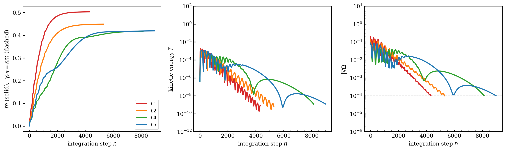

# A MemComputing Approach to Orbital Mechanics

[](https://cibt6y78bubnrhjmev3nbt.streamlit.app)

👉 **Live app** (memory-as-dissipation discovery): [cibt6y78bubnrhjmev3nbt.streamlit.app](https://cibt6y78bubnrhjmev3nbt.streamlit.app)

A MemComputing machine — an autonomous dynamical system whose **dissipation is
controlled by a memory degree of freedom** — that discovers **all five Lagrange
points of *every* two-body system in the solar system**, from a generic grid and
with no solution coordinates supplied. Verified on **all 23** Sun–planet and
planet–moon pairs, with mass ratios from μ ≈ 2×10⁻⁹ (Mars–Deimos) to μ ≈ 0.11
(Pluto–Charon).

The MemComputing paradigm maps a problem's solutions onto the fixed points of a
dynamical system and solves it in an augmented phase space of relaxed variables
plus memory degrees of freedom. Used mostly for combinatorial optimization, here
it is transcribed into celestial mechanics.

Paper: [`dmm_lagrange_ajp.tex`](dmm_lagrange_ajp.tex) / [`.pdf`](dmm_lagrange_ajp.pdf)
("A MemComputing Approach to Orbital Mechanics," D. Henrich & M. Di Ventra).
Based on M. Di Ventra, *MemComputing: Fundamentals and Applications of Time
Non-Locality* (Oxford, 2022).

---

## 1. The physics

Work in the co-rotating frame of the two primaries (mass ratio
$\mu = M_2/(M_1+M_2)$), in units where their separation and the orbital angular
velocity are both 1. The primary sits at $(-\mu,0)$, the secondary at
$(1-\mu,0)$. A test particle feels the **Jacobi effective potential**

$$\Omega(x,y)=\frac{x^2+y^2}{2}+\frac{1-\mu}{r_1}+\frac{\mu}{r_2},\qquad
r_1=\sqrt{(x+\mu)^2+y^2},\;\; r_2=\sqrt{(x-1+\mu)^2+y^2}.$$

The first term is the centrifugal potential of the rotating frame; the other two
are the gravity wells of the primaries. A **Lagrange point** is a relative
equilibrium — the particle is stationary in the rotating frame — so every
velocity and acceleration vanishes and the condition collapses to a single
vector clause:

$$\boxed{\;\nabla\Omega(x,y)=\mathbf{0}\;}$$

This has exactly five solutions: three **collinear saddle points** $L_1,L_2,L_3$
on the axis $y=0$, and two **triangular maxima** $L_4,L_5$ at
$(\tfrac12-\mu,\pm\tfrac{\sqrt3}{2})$.

The single most useful local quantity is the **transverse curvature**

$$\Omega_{yy}=1-\frac{1-\mu}{r_1^3}+\frac{3(1-\mu)y^2}{r_1^5}
              -\frac{\mu}{r_2^3}+\frac{3\mu y^2}{r_2^5}.$$

Its sign tells a saddle from a maximum using only information available at the
current point: $\Omega_{yy}<0$ at the collinear points (e.g. Earth–Moon:
$-4.15,-2.19,-0.011$ at $L_1,L_2,L_3$), $\Omega_{yy}>0$ ($+2.25$) at $L_4,L_5$.


*Left: the curvature $\Omega_{yy}$. Red ($\Omega_{yy}<0$) is where the
correction current activates. Right: the effective potential $\Omega$. Stars
mark the five Lagrange points.*

---

## 2. The MemComputing machine

The machine is an autonomous dynamical system in the co-rotating frame. To the
ordinary gradient force and Coriolis acceleration we add a viscous term whose
coefficient is **not constant** but is set by a memory degree of freedom $m$:

$$\boxed{\;
\begin{aligned}
\ddot x &= 2\dot y \;-\; \partial_x\Omega \;-\; \gamma_{\rm eff}\,\dot x,\\
\ddot y &= -2\dot x \;+\; \sigma\,\partial_y\Omega \;-\; \gamma_{\rm eff}\,\dot y,\\
\dot m &= \beta\,\lVert\nabla\Omega\rVert,\qquad m\le m_{\rm cap},\\
\gamma_{\rm eff} &= \gamma_0 + \kappa\,m .
\end{aligned}\;}$$

The augmented phase space is $(x,y,\dot x,\dot y,m)$ — the relaxed variables and
their velocities, plus the single memory variable.

| Term | Role |
|------|------|
| $\pm2\dot y,\ \mp2\dot x$ | Coriolis (rotating frame; does no work) |
| $-\partial_x\Omega,\ \sigma\,\partial_y\Omega$ | gradient force, unit gain |
| $\sigma=\mathrm{sign}(-\Omega_{yy})$ | **correction current** — flips the transverse force where $\Omega_{yy}<0$, turning the collinear **saddles into attractors** |
| $\dot m=\beta\lVert\nabla\Omega\rVert$ | **memory** — monotone ratchet $m(t)=\beta\!\int_0^t\!\lVert\nabla\Omega\rVert\,d\tau$, a Lyapunov-type functional |
| $\gamma_{\rm eff}=\gamma_0+\kappa m$ | **dissipation** — memory sets the damping coefficient |

**Why the memory enters the dissipation.** Along the motion the kinetic-energy
budget is $\dot T = -\dot{\mathbf r}\!\cdot\!\nabla_{\!\sigma}\Omega
-(\gamma_0+\kappa m)\lVert\dot{\mathbf r}\rVert^2$ (the Coriolis force does no
work). The only sign-definite, energy-removing term is the viscous one, so a
memory that is to be dynamically active must couple there — to the velocity. With
**$\gamma_0=0$** the memory is the *sole* source of dissipation: the flow is
undamped at $t=0$ and acquires braking only as $m$ accumulates the history of the
clause violation. This monotone functional drains kinetic energy until the
trajectory is quenched at a fixed point of the dynamics — a Lagrange point. (We
use a single **scalar** memory so both axes damp equally; a per-axis rule would
underdamp the collinear $y$-direction and drift past $L_2,L_3$.)



*Along the converging Earth–Moon trajectories: the memory $m$ and the dissipation
$\gamma_{\rm eff}=\kappa m$ it generates ratchet up from zero and saturate
(left); the kinetic energy $T$ is driven to zero (centre); the clause violation
$\lVert\nabla\Omega\rVert$ decays below threshold (right). With $\gamma_0=0$ the
memory is the only term that removes energy.*


*Representative trajectories to all five Lagrange points (Earth–Moon), one per
equilibrium. No solution coordinates are given to the integrator.*

---

## 3. Finding all five for *any* system

The seed grid uses only the **generic structure** of the restricted three-body
problem — never the solution coordinates. The collinear $L_1,L_2$ lie on the
rotating axis within a Hill radius $r_H=(\mu/3)^{1/3}$ of the secondary; $L_3$
sits opposite the primary near $x=-1$; $L_4,L_5$ form equilateral triangles with
the primaries. So the grid seeds (`build_grid` in `solar_system_dmm_v3.py`):

- on-axis points $(1-\mu)\pm c\,r_H$, $c\in\{0.5,0.7,1,1.4,2,3,5,8\}$ → $L_1,L_2$
- points near $x=-1$ → $L_3$
- a block around $(\tfrac12,\pm\tfrac{\sqrt3}{2})$ → $L_4,L_5$
- a coarse off-axis fill for the broad large-$\mu$ basins

The memory flow then localizes the basins and a few Newton iterations on
$\nabla\Omega=\mathbf0$ snap each endpoint to the exact, $\mu$-dependent zero
(the five $L$-points are the *only* exact zeros). This is what lets the **same
machine with the same parameters** resolve all five down to $\mu\approx10^{-9}$,
where the corotation ridge ($\nabla\Omega\approx0$ along $r=1$) makes the
collinear points delicate.

---

## 4. Results — all 23 two-body systems

The **same** machine with the **same** parameters discovers all five Lagrange
points of every Sun–planet and planet–moon pair in the solar system. All return
**5/5**; refined positions agree with the analytic points to $<10^{-9}$. $L_4/L_5$
are linearly stable for $\mu<\mu_{\rm Routh}=0.03852$ (all but Pluto–Charon).

| System | $\mu$ | Found | | System | $\mu$ | Found |
|---|---|---|---|---|---|---|
| Mars–Deimos | $2.3\times10^{-9}$ | 5/5 | | Sun–Uranus | $4.4\times10^{-5}$ | 5/5 |
| Sun–Pluto | $6.6\times10^{-9}$ | 5/5 | | Jupiter–Io | $4.7\times10^{-5}$ | 5/5 |
| Mars–Phobos | $1.7\times10^{-8}$ | 5/5 | | Sun–Neptune | $5.1\times10^{-5}$ | 5/5 |
| Sun–Mercury | $1.7\times10^{-7}$ | 5/5 | | Jupiter–Callisto | $5.7\times10^{-5}$ | 5/5 |
| Saturn–Enceladus | $1.9\times10^{-7}$ | 5/5 | | Jupiter–Ganymede | $7.8\times10^{-5}$ | 5/5 |
| Sun–Mars | $3.2\times10^{-7}$ | 5/5 | | Neptune–Triton | $2.1\times10^{-4}$ | 5/5 |
| Sun–Venus | $2.4\times10^{-6}$ | 5/5 | | Saturn–Titan | $2.4\times10^{-4}$ | 5/5 |
| Sun–Earth | $3.0\times10^{-6}$ | 5/5 | | Sun–Saturn | $2.9\times10^{-4}$ | 5/5 |
| Saturn–Rhea | $4.1\times10^{-6}$ | 5/5 | | Sun–Jupiter | $9.5\times10^{-4}$ | 5/5 |
| Jupiter–Europa | $2.5\times10^{-5}$ | 5/5 | | Earth–Moon | $1.2\times10^{-2}$ | 5/5 |
| Uranus–Oberon | $3.5\times10^{-5}$ | 5/5 | | Pluto–Charon | $1.1\times10^{-1}$ | 5/5 |
| Uranus–Titania | $4.1\times10^{-5}$ | 5/5 | | | | |

Reproduce with `python improved_check.py` (23/23) or run the app on any system.

---

## 5. Scope and honest notes

- **Corotation-ridge degeneracy at small μ — handled.** As $\mu\to0$,
  $\Omega\to\tfrac12 r^2+1/r$, whose gradient vanishes along the **entire** unit
  circle $r=1$, not at isolated points, so any fixed threshold is met *everywhere*
  on the ridge and a naive grid halts on spurious points (the collinear $L_1,L_2$
  and even $L_4,L_5$, which lie on $r=1$, are lost). The **structural seed grid**
  of §3 — on-axis Hill-radius seeds around the secondary, an equilateral block for
  $L_4,L_5$ — gives the flow the foothold it needs, so all five are resolved down
  to $\mu\approx10^{-9}$ (§4). This is a property of the potential at extreme mass
  ratios, addressed by seeding, not a solver bug.
- **Memory is a single scalar.** $m$ provides a genuine, monotone, dissipative
  (Lyapunov-type) role, but it is one scalar controlling a viscous coefficient —
  not yet the full vector, constraint-coupled memory structure of a *universal*
  Digital MemComputing Machine. A complete Lyapunov analysis and a vector-memory
  extension are the natural next steps.
- **Speed.** With $\gamma_0=0$ the damping ramps up from zero, so convergence is
  slower than a tuned constant-damping descent (median ~3×10⁴ steps on
  Earth–Moon). A small $\gamma_0>0$ floor trades the "memory is the *sole*
  dissipation" purity for speed.
- **Not a competitor to root-finding.** Newton/Brent locate a single point in
  $\mathcal O(10)$ evaluations *given a bracket or guess*. This system finds all
  five from a generic grid with no such input, at $10^4$–$10^5$ evaluations per
  trajectory. Its purpose is to isolate the computational role of memory, not to
  outrun a solver whose answers are already bracketed.

---

## 6. Run

```bash
pip install -r requirements.txt
streamlit run solar_system_dmm_v3.py   # the method described above (memory-as-dissipation)
# streamlit_app.py is the deploy entry point and launches the same v3 app
```

Pick a two-body system in the sidebar, set the controls ($\gamma_0,\kappa,\beta$,
grid), and press **Run**. The *Memory dynamics* tab shows $m$, $\gamma_{\rm eff}$,
the kinetic energy $T\to0$, and $\lVert\nabla\Omega\rVert$ — i.e. memory doing
the work.

### Bonus: all Sun–planet Lagrange points at once (`solar_system_dmm_v4.py`)

```bash
streamlit run solar_system_dmm_v4.py
```


A heliocentric snapshot of every Sun–planet pair's five Lagrange points,
superposed at a chosen epoch (● collinear, ▲ L4 +60°, ▼ L5 −60°). **Important:**
the full Sun + 8-planet system has **no global Lagrange points** — the planets
orbit at different rates, so no co-rotating frame freezes them all and no
time-independent $\Omega$ exists. This view superposes the *per-pair* points
(each discovered by the v3 DMM and mapped to AU), which is where real objects
sit — JWST at Sun–Earth $L_2$, the Jupiter Trojans at $L_4/L_5$.

### Bonus: which Lagrange points are dynamically *stable*? (`solar_system_dmm_v5.py`)

```bash
streamlit run solar_system_dmm_v5.py
```


v3 *locates* the equilibria; v5 asks which ones actually **hold particles**. It
forward-integrates clouds of test particles in the time-dependent field of the
**Sun + planets** (heliocentric velocity-Verlet *with the indirect term*) and
shows which survive. $L_4/L_5$ (stable for $\mu<0.03852$) trace **tadpole**
librations and stay — period $\approx T/\sqrt{27\mu/4}$, ~148 yr for Jupiter,
matching theory to 0.1% in the validation. The collinear $L_1/L_2/L_3$ (saddles)
drift away. A toggle switches between "Sun + host planet" (restricted 3-body) and
"Sun + all 8 planets" (the full time-dependent field) to see the perturbations.
This is the dynamical face of the curvature sign $\Omega_{yy}$ that v3 reads.

| File | Description |
|------|-------------|
| `streamlit_app.py` | Default deploy entry point → launches the v3 app |
| `solar_system_dmm_v3.py` | The app: memory-as-dissipation across 23 two-body systems |
| `nbody_trojan.py` | **Single source of truth** for CR3BP geometry + heliocentric dynamics (see §7) |
| `test_nbody_trojan.py` | Numerical regression tests — the physics claims above, as `assert`s |
| `dmm_lagrange_ajp.tex` / `.pdf` | **Paper** (AJP submission) — "A MemComputing Approach to Orbital Mechanics," full equations + all parameters + the all-23 table |
| `dmm_lagrange_v3.tex` / `.pdf`, `dmm_lagrange_stability.tex` / `.pdf` | Earlier editions (with the energy-identity exposition; stability cross-check) |
| `all_systems_check.py`, `improved_check.py` | All-23-systems verification (old grid 9/23 → structural grid 23/23) |
| `generate_v3_figures.py`, `generate_memory_clean.py` | Reproduce the figures above (PDF + PNG) |
| `diagnose_concerns.py`, `explore_sigma_memory.py`, `test_v3_core.py` | Validation scripts — every number here is reproducible |
| `requirements.txt` | numpy, scipy, matplotlib, streamlit, plotly |

---

## 7. Code architecture — one source of truth, with tests

The CR3BP geometry — the effective potential $\Omega$, its gradient, the
curvature $\Omega_{yy}$, and the five Lagrange points — was previously
copy-pasted verbatim across **seven** scripts
(`solar_system_dmm_v3/v4.py`, `generate_v3_figures.py`, `explore_sigma_memory.py`,
`test_v3_core.py`, `diagnose_concerns.py`, `dmm_discovery.py`). A bug fix to the
`brentq` bracket or the `1e-9` softening would have had to be applied in seven
places, and the copies had already begun to drift (one used a slightly different
L1 root-finding bracket; another had a *negated* $\Omega$ for a contour plot).

These functions now live once in **`nbody_trojan.py`**:

```python
effective_potential(x, y, mu)   # Ω(x,y)
grad_curv(x, y, mu)             # (∂ₓΩ, ∂ᵧΩ, Ωᵧᵧ)
analytical_collinear(mu)        # x-positions of L1, L2, L3
lpoints(mu)                     # dict {L1..L5: np.array([x,y])}
```

Every consumer imports them. Two files keep thin local adapters where their
signature differed (`grad_and_curvature(pos, mu)` taking a tuple), and
`dmm_discovery.py`'s *negated* potential is intentionally left local with a
comment, since flipping its sign would change the plot.

### Tests (`test_nbody_trojan.py`)

The numbers the manuscript relies on are now pinned as assertions, so any
regression in the consolidated code fails loudly:

```bash
python test_nbody_trojan.py        # or: python -m pytest test_nbody_trojan.py -v
```

| Test | What it pins |
|------|--------------|
| `test_l4_l5_are_equilateral` | L4/L5 form unit equilateral triangles with the primaries |
| `test_collinear_points_on_xaxis` | L1/L2/L3 lie on y=0, ordered correctly |
| `test_gradient_zero_at_lagrange_points` | $\nabla\Omega=\mathbf 0$ at all five equilibria |
| `test_gradient_formula_matches_reference` | the exact textbook gradient expression (bit-for-bit) |
| `test_effective_potential_formula` | the exact $\Omega$ expression |
| `test_jacobi_constant_jupiter_l4` | Jacobi constant conserved to rel $<10^{-6}$ over 200 yr (manuscript: ~$10^{-8}$) |
| `test_l4_bounded_libration_jupiter` | a body at Jupiter L4 stays bounded over 1000 yr (no escape) |
| `test_trojan_libration_period` | $T_{\rm lib}=P/\sqrt{27\mu/4}\approx 148$ yr for Jupiter |
| `test_seed_lpoint_corotation_velocity` | seed velocity is exact co-rotation $v=n\,\hat z\times r$ |

All nine pass. They double as living documentation of the physics claims in
§4–§5.

### Bug caught by the refactor

Consolidating the functions surfaced one real regression: `solar_system_dmm_v4.py`
called a local `analytic_collinear` (no "a") from its `lpoints_heliocentric`
helper, but that helper was easily missed when the top-level copy was removed.
Fixed by importing `analytical_collinear as analytic_collinear` so the existing
call site works unchanged. The test import path catches this class of error.

---


## References

1. M. Di Ventra, *MemComputing: Fundamentals and Applications of Time Non-Locality*, Oxford University Press (2022)
2. F. L. Traversa & M. Di Ventra, "Universal Memcomputing Machines," *IEEE Trans. Neural Netw. Learn. Syst.* **26**, 2702 (2015)
3. V. Szebehely, *Theory of Orbits: The Restricted Problem of Three Bodies*, Academic Press (1967)
4. D. Henrich, "DigitalMemComputing," GitHub (2026): https://github.com/drhenrich/DigitalMemComputing
