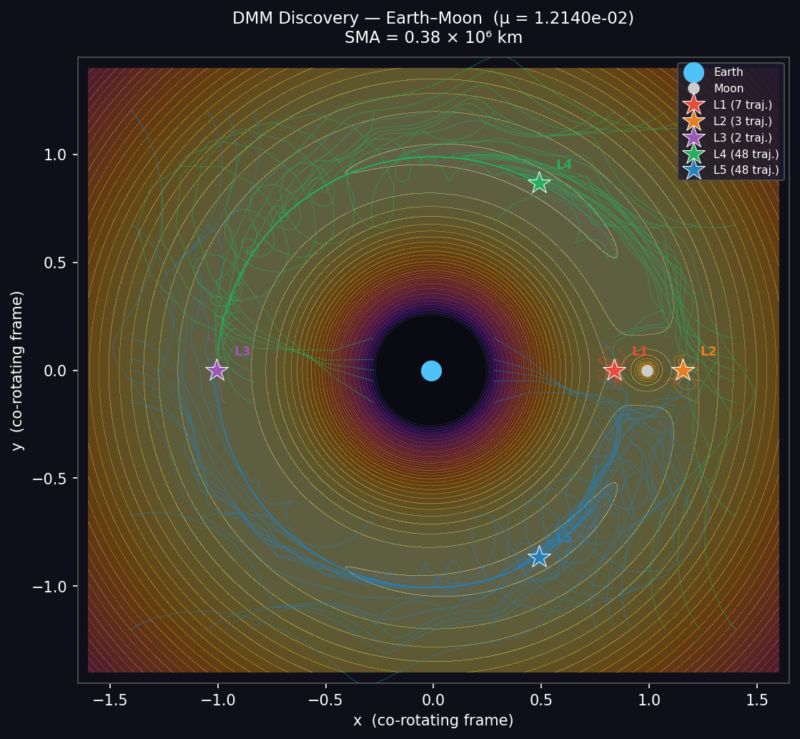
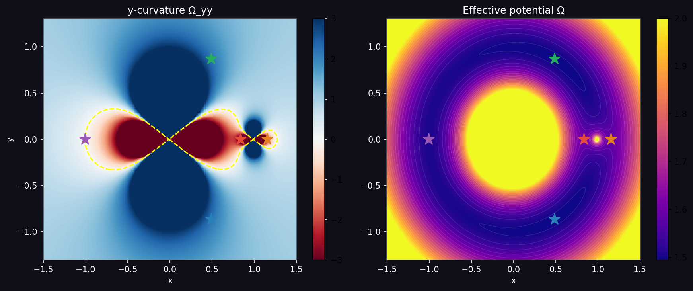
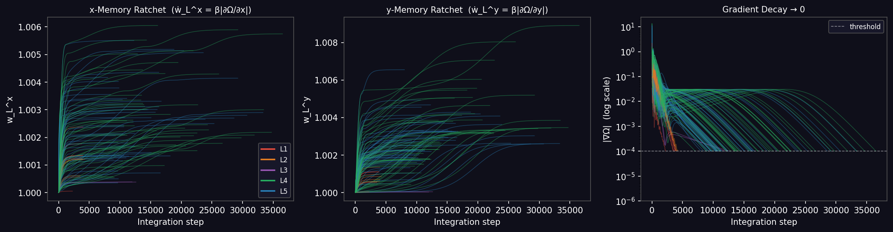

# Digital MemComputing — Lagrange Point Discovery

[](https://digitalmemcomputing-msoefuhpx3swcae4pzs2xr.streamlit.app)

👉 **Earth–Moon app (v1):** [digitalmemcomputing-msoefuhpx3swcae4pzs2xr.streamlit.app](https://digitalmemcomputing-msoefuhpx3swcae4pzs2xr.streamlit.app)

👉 **Solar system app (v2):** [8ywc2na6utq2km8ga7xnke.streamlit.app](https://8ywc2na6utq2km8ga7xnke.streamlit.app)

A Python implementation of a **Digital MemComputing Machine (DMM)** that discovers all five Lagrange points of any two-body system in the solar system — **without prior knowledge** of how many solutions exist or where they are.

Based on: *Massimiliano Di Ventra — MemComputing: Fundamentals and Applications of Time Non-Locality* (Oxford University Press, 2022).

---

## What is new in v2 (solar_system_dmm_v2.py)

| Feature | v1 | v2 |
|---|---|---|
| **Memory rule** | Short-term EMA → long-term ratchet (2-stage, α + β) | Direct gradient: `ẇ_L^i = β·\|∂_iΩ\|` (1 parameter) |
| **Phase space** | 8D: (x, y, ẋ, ẏ, sm_x, sm_y, w_L^x, w_L^y) | 6D: (x, y, ẋ, ẏ, w_L^x, w_L^y) |
| **Memory plot** | Single average w̄_L | Per-axis w_L^x and w_L^y separately |
| **Coverage** | Earth–Moon only | 23 two-body pairs across the solar system |
| **Grid anchors** | Fixed (−1.0, 0.9, 1.1) | Dynamic — computed from exact L-point positions |
| **Exclusion zone** | Fixed 0.015 | Adaptive: min(0.012, 0.3·r_Hill) |

---

## Key idea

Classical solvers (Newton, Brent) require one targeted call per solution and prior knowledge of the solution structure.
The DMM instead maps the constraint problem — find all (x, y) where ∇Ω = 0 — onto a continuous dynamical system in extended phase space.
Memory variables grow as **dynamic Lagrange multipliers**, amplifying the driving force until every clause is satisfied.

The critical novelty is the **adaptive correction current**: at each step the machine reads the local y-curvature Ω_yy and adapts its force sign automatically.
At saddle points (L1/L2/L3, Ω_yy < 0) the correction current flips the repulsive y-force into a restoring one, converting classically unstable equilibria into stable fixed points.
At stable attractors (L4/L5, Ω_yy > 0) standard memory amplification applies.
No solution coordinates are ever provided.

---

## Discovery map (Earth–Moon)



Each coloured line is one DMM trajectory evolving from a grid start. Every trajectory terminates at a Lagrange point (★). L4/L5 attract most of the plane; L1/L2/L3 have narrow basins but are reliably found via the correction-current mechanism.

---

## Effective potential and local curvature



**Left:** the local y-curvature Ω_yy across the co-rotating plane. Red regions (Ω_yy < 0) trigger the correction current — standard gradient descent would diverge here. Blue regions (Ω_yy > 0) use standard memory amplification. The dashed yellow contour marks Ω_yy = 0.

**Right:** the effective potential Ω(x, y). All five Lagrange points are critical points (∇Ω = 0) with different topological types — two stable attractors (L4/L5), three saddles (L1/L2/L3).

---

## v2 Memory dynamics — per-axis ratchets



**Left:** x-axis long-term memory w_L^x ratchet — grows as `ẇ_L^x = β|∂Ω/∂x|`.
**Centre:** y-axis long-term memory w_L^y ratchet — grows as `ẇ_L^y = β|∂Ω/∂y|`.
Both integrate the gradient magnitude directly and saturate only when the clause is satisfied.
**Right:** clause violation |∇Ω| falls to zero — the machine halts only when all constraints are met. Colour encodes the discovered L-point.

---

## Equations of motion (v2)

In the co-rotating frame with Coriolis terms:

```
ẍ = 2ẏ − w_L^x · ∂Ω/∂x − γẋ
ÿ = −2ẋ + σ · w_L^y · ∂Ω/∂y − γẏ
```

where `σ = +1` if `Ω_yy < 0` (correction current) and `σ = −1` otherwise.

**v2 Memory update — direct gradient integration:**
```
w_L^x ← min(w_L^x + β · |∂Ω/∂x| · Δt,  w_cap)
w_L^y ← min(w_L^y + β · |∂Ω/∂y| · Δt,  w_cap)
```

Closed form: `w_L^i(t) = 1 + β ∫₀ᵗ |∂_iΩ(r(τ))| dτ`
— the memory equals the arc-length integral of the per-axis gradient along the instanton path.

**Effective potential:**
```
Ω = (x² + y²)/2 + (1−μ)/r₁ + μ/r₂
```

**Local y-curvature (computed at each step, no prior knowledge):**
```
Ω_yy = 1 − (1−μ)/r₁³ + 3(1−μ)y²/r₁⁵ − μ/r₂³ + 3μy²/r₂⁵
```

---

## Speed comparison with classical methods

| Method | Time / point | Func. evals | Error | Prior knowledge |
|--------|-------------|-------------|-------|-----------------|
| Brent | < 0.1 ms | 12–18 | machine ε | bracket + know y = 0 |
| Newton / fsolve | < 0.1 ms | 9–34 | ~10⁻¹⁴ | 1 guess per point |
| Nelder-Mead | < 1 ms | 150–600 | ~10⁻¹¹ | 1 guess per point; **cannot find saddles** |
| Homotopy | ~1 s | ~10³ | ~10⁻¹² | algebraic system required |
| **DMM v2 (this work)** | 70–400 ms | 6,000–40,000 | 10⁻⁵–10⁻⁴ | **none** |

DMM is slower per individual point but discovers **all 5 solutions simultaneously** — including saddles — from a single grid with no knowledge of solution count or location. Classical methods are faster only when the solution structure is already known.

---

## Solar system coverage (v2)

| System | μ | L4/L5 stable | Known objects |
|--------|---|---|---|
| Sun–Earth | 3.0 × 10⁻⁶ | ✓ | L1: SOHO, DSCOVR · L2: JWST, Gaia, Planck |
| Sun–Jupiter | 9.5 × 10⁻⁴ | ✓ | L4/L5: >7,000 Trojan asteroids each |
| Earth–Moon | 1.2 × 10⁻² | ✓ | L2: ARTEMIS · L4/L5: proposed stations |
| Sun–Mars | 3.2 × 10⁻⁷ | ✓ | L4/L5: Mars Trojans |
| Pluto–Charon | 1.1 × 10⁻¹ | ✗ (Routh) | μ > 0.03852 — L4/L5 linearly unstable |

23 two-body pairs total: Sun + all 8 planets + major moons (Moon, Io, Europa, Ganymede, Callisto, Titan, Triton, Charon).

---

## Analytic L-point positions (Earth–Moon, μ = 0.0121)

| Point | x | y | Ω_yy | Type |
|-------|---|---|------|------|
| L1 | 0.83716 | 0.00000 | −4.15 | saddle (Moon-inner) |
| L2 | 1.15549 | 0.00000 | −2.19 | saddle (Moon-outer) |
| L3 | −1.00504 | 0.00000 | −0.011 | saddle (Earth-far) |
| L4 | 0.48790 | +0.86603 | +2.25 | equilateral — stable |
| L5 | 0.48790 | −0.86603 | +2.25 | equilateral — stable |

L4/L5 stability requires μ < 0.03852 (Routh's criterion).

---

## Files

| File | Description |
|------|-------------|
| `solar_system_dmm_v2.py` | **Main app v2** — direct-gradient memory, 23 solar system pairs |
| `solar_system_dmm.py` | Solar system app v1 — two-stage memory (α + β) |
| `dmm_discovery.py` | Earth–Moon only app — original discovery simulation |
| `3body_app.py` | Earlier app — single L-point targeting with interactive 3D surface |
| `dmm_lagrange.tex` | Scientific article (LaTeX, two-column, 8 pages) |
| `dmm_lagrange.pdf` | Compiled PDF |
| `requirements.txt` | Python dependencies |

---

## Run locally

```bash
pip install -r requirements.txt

# Solar system v2 — direct-gradient memory, 23 two-body pairs
streamlit run solar_system_dmm_v2.py

# Solar system v1 — two-stage memory
streamlit run solar_system_dmm.py

# Earth–Moon only
streamlit run dmm_discovery.py
```

Open [http://localhost:8501](http://localhost:8501). Select a system category and pair in the sidebar, adjust β, memory cap, damping and grid density, then click **▶ Run DMM Discovery**.

---

## References

1. M. Di Ventra, *MemComputing: Fundamentals and Applications of Time Non-Locality*, Oxford University Press (2022)
2. F. L. Traversa & M. Di Ventra, "Universal Memcomputing Machines," *IEEE Trans. Neural Netw. Learn. Syst.* **26**, 2702 (2015)
3. M. Di Ventra & F. L. Traversa, "Perspective: Memcomputing," *J. Appl. Phys.* **123**, 180901 (2018)
4. Y. Dauphin et al., "Identifying and attacking the saddle point problem," NeurIPS (2014)
5. V. Szebehely, *Theory of Orbits*, Academic Press (1967)
6. D. Henrich, "DigitalMemComputing," GitHub (2026): https://github.com/drhenrich/DigitalMemComputing
